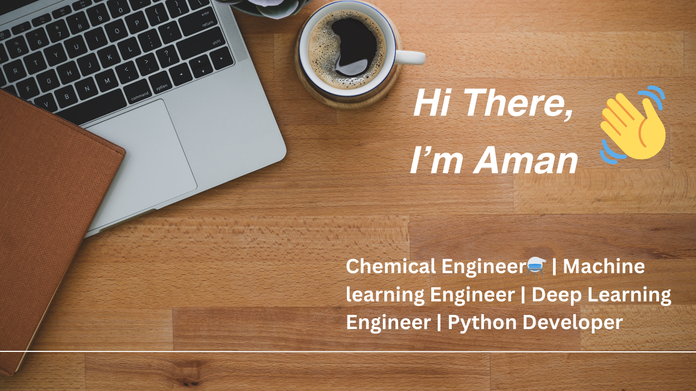

  

- 🔭 I’m currently working on [ChatBOT](https://github.com/amansin05/ChatBOT)

- 🌱 I’m currently learning **Machine Learning**

- 🤝 I’m looking for help with [ChatBOT](https://github.com/amansin05/ChatBOT)

- 📫 How to reach me **amansinghal05082003@gmail.com**

## Github Stats :

  

## Languages and tools :

 

 
 

<h3 align="left"> Skills:</h3>

<h4 align="left"> Programming Languages:</h4>

     

<h4 align="left"> Data Science and Machine Learning:</h4>

    

<h4 align="left"> Version Control and Collaboration:</h4>

  

<h4 align="left"> Database:</h4>

  

 
 

<h2>

</h2>
